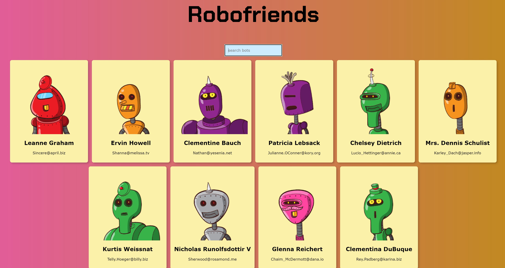

# My React App
Playing with creating a React app following a tutorial. I customized it to use hooks instead of classes as well as updating some "aesthethics".

The page allows you to search based on the cards available on the page and update as you type in your search for a name.

The page gets the images for the robots from [robohash.org](https://robohash.org/) which are created based on hashes so that each one is different from one another for each of the cards. Also the data for the individuals is fetched from [JSON placeholder](https://jsonplaceholder.typicode.com/) a fake API for testing and prototyping.

